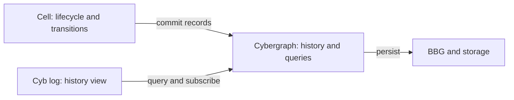

# history ownership

The cyb log organ presents the history of interactions. It can filter, search,
group causal activity and navigate time. Cybergraph is the authoritative graph
of those interactions. Cell defines its lifecycle records and drives transitions
through cybergraph. BBG and the graph's storage adapters supply persistence.

The earlier convergence draft assigned journal ownership to log. This revision
corrects that boundary following the user's clarification.

## source findings

[cyb log](../../cyb/parts/log.md) identifies history with the durable graph tape.
[BBG storage](../../bbg/specs/storage.md) describes signal-first persistence and
derived state. The implementation currently splits that promise across layers:

- [Cybergraph](../../cybergraph/src/api.rs) holds BBG state and signal chains and
  applies signals. Its constructor currently has no durable storage parameter.
- [cyb_core::Cell](https://github.com/cyberia-to/cyb/blob/7f22732cbb0eeb52550dd18dbaa3621bb73eca7d/core/src/cell.rs) opens, replays and appends graph.log.
  It applies a signal before appending its frame and discards write/flush errors.
- [BBG storage](../../bbg/rs/src/storage/mod.rs) supplies disk backends, but its
  ShardStore commit API returns a particle without an error result.
- [FjallStore](../../bbg/rs/src/storage/fjall.rs) currently discards insertion and
  persistence errors. The BBG facade's in-memory state and these backends still
  need an integrated durable transaction path for cell's requirements.

Thus existing storage mechanisms are present, and the end-to-end durability
guarantee needs implementation work. The specification names that work at the
cybergraph/bbg boundary.

## the additional semantics

Cell needs to distinguish an input being accepted, a transition being committed,
an act awaiting execution, an attempt having an unknown outcome, and a result
being consumed. These are particles and cyberlinks in the same graph history.

An outbox is a query over committed pending acts. A checkpoint identifies an
authenticated state and the records/artifacts required to resume. A history
index accelerates a query. Each has a precise role above the storage mechanism.

The physical store may use a write-ahead log and indexes to implement atomicity.
Those are storage internals. The public history remains the cybergraph record,
with one commit identity and explicit durability/finality evidence.

The target contracts are [history](../specs/history.md),
[execution](../specs/execution.md) and [integration](../specs/integration.md).

## reviewed source revisions

Reviewed on 2026-09-11: cyb 7f22732cbb0eeb52550dd18dbaa3621bb73eca7d;
cybergraph aa374ced57eed6bbf42de0b77d29b4c5412fd30d;
bbg 450b579ac1335f2a3efb12ce56885d4f5205f3df.
