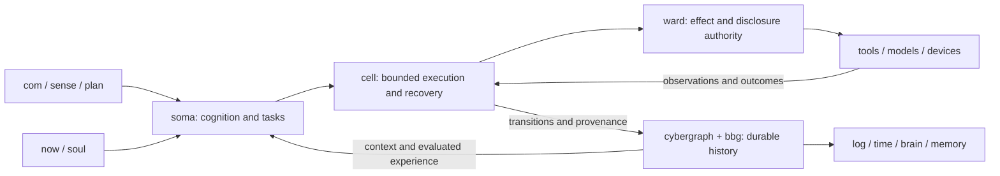

# cell foundations and agent review

The 0.1 design supplied a substantial durable execution model, but left the
connection to cyb cognition underdefined. It could have produced a reliable
generic host while leaving the agent fragmented across context, sessions, tools
and learning. The 0.2 draft makes those relationships explicit.

The convergent cell is an addressable, loaded ability with bounded state,
authority, lifetime and causal history. Local hosting realizes that same model;
protocol profiles supply their stronger guarantees. In a robot, soma supplies
the thinking and learning that make the hosted ability an agent.

This review changes specifications. No runtime, feature parity or measured
advantage over Hermes is claimed.

Model decisions and external observations follow the same operation boundary.
Vault supplies secret operations; body and sigma supply resource accounting.

## source precedence and scope

The user's latest definitions and [cyb anatomy](../../cyb/anatomy.md) govern the
21 organs. [Product philosophy](../../cyb/product/philosophy.md),
[product spec](../../cyb/product/spec.md), [truth](../../cyb/product/truth.md),
[now](../../cyb/parts/now.md), [soul](../../cyb/parts/soul.md),
[filesystem](../../cyb/parts/fs.md) and [scripting](../../cyb/reference/scripting.md)
provide product constraints. Older [robot](../../cyb/product/robot.md) and
[soma](../../soma/soma-spec.md) terminology must converge toward anatomy.
The [ctx bundle](../../ctx/ctx.md), generated on 2026-05-15, is a derived context
snapshot; [its packer](../../ctx/README.md) scores and selects graph pages. It
can seed retrieval while current sources govern definitions. Its selection
heuristic supplies no guarantee of optimal task context.

[Soft3 types](../../soft3/specs/types.md), [terms](../../soft3/specs/terms.md),
[rune execution](../../rune/specs/execution.md) and the stack ownership map
constrain implementation. [Cyberia development](../../cyberia/dev.md) supplies
the development doctrine; [quality](../../cyberia/quality.md) supplies
the review lenses: determinism, bounded locality, arithmetic, cryptography,
types, errors, adversarial inputs, composition, naming, size, performance and
testability. Existing integration findings retain their pinned source revisions
in [convergence](cell-convergence.md) and [history ownership](history-ownership.md).

The Hermes baseline is source inspection of
[d15ed4445207dda418b984e8bda0f68f48b8c6f3](https://github.com/NousResearch/hermes-agent/tree/d15ed4445207dda418b984e8bda0f68f48b8c6f3).
It covers the mechanisms below; the complete command/tool/platform inventory
remains a prerequisite to claiming full functional parity.

Local source revisions at final verification:

| Repository | Revision |
|---|---|
| cyb | 63e533157ac3f2656c9669b30e412b43e53c1aa0 |
| soft3 | 77c780cef2ce07bff29855278a465ff070a91102 |
| rune | 67281db727070c1160c12be341c6fd85e39e5380 |
| soma | 312177028abeecaf252e0c72d25f8e3fc1dc8985 |
| ctx | 688d859ffbd2851f3b6976fae73975966a808176 |
| cyberia | bacb7a378b9381b7d3df684d1ceedef73cbe5c79 |
| cyber | eecfe635a7309d590d6181b67c5636cd5e2021a5 |
| tru | de5e5517ed741d5d633519fa9686c2f242f623c7 |

Cyb advanced from 7f22732cbb0eeb52550dd18dbaa3621bb73eca7d during this review.
The inspected anatomy/product/parts/scripting/context contracts are unchanged;
the robot host changes were checked separately. Earlier runtime/storage findings
retain the source revisions documented in the convergence review.

## findings and specification corrections

Severity describes consequence if implemented as previously written. Every
correction below is a draft requirement awaiting executable validation.

| Finding | Consequence | Correction in 0.2 |
|---|---|---|
| High: application context implicit | A restored task could silently use another now, soul or workspace | Event/Continuation bind context; explicit steering and source manifests |
| High: installation dominates the model | Every small extension could acquire deployment/proof ceremony | Immediate local gate path, automatic descriptors, explicit stronger profiles |
| High: schema identity hashes a name | Different meanings could masquerade behind the same schema particle | Content-bound schema manifests and pinned suite; concrete codec gate |
| High: generic history without semantic projection | Durable transcript alone gives weak retrieval and learning | Soma publishes task/context/skill provenance through the same graph |
| High: no complete agency contract | Cell conformance could be mistaken for a usable agent | Agent composition requirements and complete capability inventory |
| High: delegation lifetime and budgets underspecified | Restart loses child ownership or renews spent budget | Durable joins, reservations, cancellation and result adoption |
| High: checkpoint could be confused with workspace rollback | Restored VM state could overwrite later user edits | Versioned file observations and authorized conditional compensation |
| Medium: flat snapshot collections | Work may scale with total retained history per transition | Persistent stack indexes and bounded graph access |
| Medium: resource economy absent | Many parked cells retain unnecessary VMs or model copies | Shared immutable artifacts, parking and measured resource budgets |
| High: learning evidence contract absent | Skill adoption lacks explicit task-level evaluation and conviction rules | Extend existing evidence distinctions into evaluated skill promotion |
| High: superiority lacks falsifiable criteria | Architecture language substitutes for user outcomes | Paired task, recovery, learning and cost gates |

The original authority, crash, finality, content-closure and relocation contracts
remain essential. In particular, rune authority propagation, graph atomicity and
storage error handling remain implementation blockers documented in
[integration](../specs/integration.md). Specification repairs do not fix those
upstream implementations.

## all 21 organs

Every responsibility has one owner. This matrix constrains cell's boundary; it
does not decide whether every organ should become a standalone repository.

| Organ | Relationship to cell and agent |
|---|---|
| name | Resolves named definitions/instances; an NFT is unnecessary for local execution |
| avatar | Renders the robot's appearance; cell carries versioned presentation bindings |
| soul | Owns configuration; each ask pins its version, ward applies live policy |
| ward | Enforces effects, disclosure, grants and delegated limits |
| soma | Owns model use, cognition, task strategy, context selection and learning |
| brain | Renders graph state and relations, including task/skill provenance |
| memory | Presents particles as a filesystem; external file adapters declare consistency |
| com | Admits user asks/steering with now and soul and presents progress |
| sense | Owns conversations and recipient delivery; task execution has its own identity |
| voice | Supplies speech inputs/outputs with media artifacts and declared evidence |
| vision | Supplies camera/screen/world observations through permitted device operations |
| state | Supplies external values with verification tiers preserved in receipts/context |
| sigma | Owns assets/neurons and monetary accounting for authorized actions |
| vault | Holds secrets and signs; checkpoints retain references with rebinding rules |
| log | Presents causal history queried from cybergraph |
| now | Owns the graph context hinge; running tasks retain admitted bindings |
| plan | Owns standing orders, schedule occurrence identities and catch-up policy |
| time | Presents log, now and plan around a temporal cursor |
| body | Owns silicon, devices, process supervision, energy and physical resource accounting |
| cell | Hosts loaded abilities with explicit state, authority, lifetime and recovery |
| radio | Transports declared protocols; authority/admission semantics survive transport changes |

Repository, organ and instance counts are independent. A standalone cell is
justified by its shared host/model across several consumers. Ward and vault are
strong independent boundary candidates because enforcement and secret operations
need uniform contracts. The remaining extraction decisions require their own
dependency and maintenance audit. This task introduces no 22nd core organ.

## what Hermes already supplies

The comparison must respect the actual reference rather than a minimal chat loop.

| Inspected mechanism | Evidence in Hermes | Implication for cyb |
|---|---|---|
| Durable sessions | [Session storage](https://github.com/NousResearch/hermes-agent/blob/d15ed4445207dda418b984e8bda0f68f48b8c6f3/website/docs/developer-guide/session-storage.md) describes persisted messages, compaction archives and delivery/delegation bookkeeping | A durable transcript is baseline functionality |
| Extensible context | [Context engine plugins](https://github.com/NousResearch/hermes-agent/blob/d15ed4445207dda418b984e8bda0f68f48b8c6f3/website/docs/developer-guide/context-engine-plugin.md) can replace the context manager, including DAG approaches | Graph-shaped context alone is no exclusive advantage |
| Learning graph | [Learning graph implementation](https://github.com/NousResearch/hermes-agent/blob/d15ed4445207dda418b984e8bda0f68f48b8c6f3/agent/learning_graph.py) relates skills and memory chunks and tracks use | Cyb must demonstrate better grounded reuse, not just draw a graph |
| Delegation | [Delegation guide](https://github.com/NousResearch/hermes-agent/blob/d15ed4445207dda418b984e8bda0f68f48b8c6f3/website/docs/guides/delegation-patterns.md) documents isolated children; top-level async work is process-local and recommends other mechanisms for durable work | Persisted, composable joins are a concrete target to validate |
| Child permissions | [Toolset implementation](https://github.com/NousResearch/hermes-agent/blob/d15ed4445207dda418b984e8bda0f68f48b8c6f3/tools/delegate_tool_toolsets.py) bounds child toolsets by parent availability | Ward's advantage must be verified across runtimes and effect scopes |
| Scheduled attempt history | [Cron execution ledger](https://github.com/NousResearch/hermes-agent/blob/d15ed4445207dda418b984e8bda0f68f48b8c6f3/cron/executions.py) persists attempts and recognizes unknown interrupted outcomes | Explicit uncertainty is already present in part of the reference |
| Workspace rollback | [Checkpoint guide](https://github.com/NousResearch/hermes-agent/blob/d15ed4445207dda418b984e8bda0f68f48b8c6f3/website/docs/user-guide/checkpoints-and-rollback.md) describes shared shadow-git storage and preservation of later user edits | Cell execution snapshots alone would be a functional regression |
| Daily agent surface | [README](https://github.com/NousResearch/hermes-agent/blob/d15ed4445207dda418b984e8bda0f68f48b8c6f3/README.md) describes skills, memory, tools, scheduling and multiple interfaces | The Rust reimplementation needs usable end-to-end adapters |

These are source findings, not comparative reliability measurements. Missing
evidence for a global guarantee does not establish a reference defect. Inventory
and runtime tests must resolve exact behavior before a parity claim.

## where the proposed design can win

The strongest differentiator is composable continuity: one causal structure
connects intent, admitted context, tool attempts, children, artifacts, evaluation
and skill adoption. It can travel with the task under explicit authority and
availability rules. Every organ can inspect the same structure.

| Target | Mechanism | Evidence needed |
|---|---|---|
| More reliable long work | Context binding, durable continuations and operation reconciliation | Complete more interrupted tasks without duplicate effects or lost constraints |
| Useful experience transfer | Source-linked skills with evaluation, scope and revision history | Improve held-out outcomes within the same total budget |
| Portable agent lifetime | Content closure, model-independent task state and fenced relocation | Resume supported tasks on another host with correct authority and artifacts |
| Coherent user experience | CLI, cyb, time, memory and sense read the same task state | Reconnect, steer and inspect through each surface without divergence |
| Cheaper extensibility | Immediate rune gate path, shared runtime/artifacts, parked instances | Better setup time, idle cost and useful work per resource unit |

Each target is a hypothesis until measured. A graph-shaped execution record may
improve auditability while increasing storage and latency. Rust may reduce host
overhead while model cost still dominates. The evaluation includes these costs.

## research claims and dependency discipline

[Context reasoning](../../cyb/decide/context.md) and
[runtime reasoning](../../cyb/decide/runtime.md) motivate graph-local selection and
compiled-model state reuse. They are research directions. This review does not
derive optimal general LLM context or lossless arbitrary-model KV transfer from
graph connectivity. [CT-0](../../tru/specs/ct0.md) defines its own compiler and
conformance; cell treats its artifacts through declared runtime contracts.

Baseline progress needs local inference and practical external adapters, bounded
graph retrieval and honest provenance. Stronger proof/consensus/model mechanisms
join through profiles as their prerequisites become implemented and validated.

## order of implementation after specification review

| Stage | Concrete exit condition | Owning work |
|---|---|---|
| 1. Foundations | Codec/schema fixtures, graph transaction/content closure and ward regression pass | hemera/data, cybergraph, bbg, rune, ward |
| 2. One local ability | Source gate starts, performs a permitted effect, survives restart and appears in CLI/cyb | cell model/engine/node and rune/prysm adapters |
| 3. One complete agent task | Soma ask binds now/soul, uses a model and tools, produces tested artifacts and can be steered/recovered | soma, now, com, body, vault, memory |
| 4. Daily autonomy | Durable delegation, evaluated skill reuse, schedules and delivery pass end-to-end cases | soma, plan, sense, radio, sigma |
| 5. Portability and comparison | Backup/relocation checks and frozen matched Hermes suite publish scoped results | all participating owners |

Capability inventory starts before implementation so missing Hermes functionality
enters the plan explicitly. Stronger ledger/knowledge profiles can develop in
parallel without being prerequisites for an ordinary local ask.

The revised contracts are [foundations](../specs/foundations.md),
[agent composition](../specs/agent.md) and [evaluation](../specs/evaluation.md),
with updates to model, data, execution, authority, history, evolution,
integration, lifecycle, API and conformance. Review these before selecting the
first executable slice. The intended result is a complete agent whose claimed advantages are
demonstrated by work it actually finishes.
