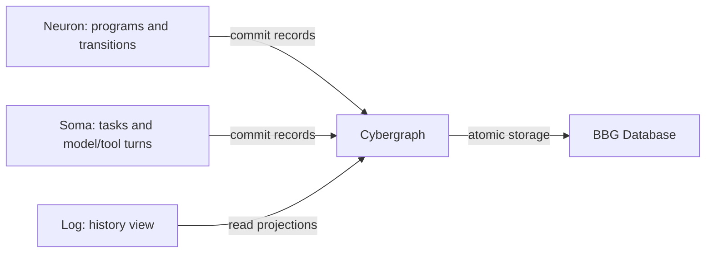

# History ownership

Log renders the history. Cybergraph supplies its authoritative records and
write/query interfaces. BBG supplies durable transactions, content, indexes and
storage recovery. Neuron writes its program/job transitions through those
owners; it does not create another independently authoritative journal.

The shared database can hold application history, native Signal chains, public
graph state and local projections under their respective owner contracts.
GraphSession gives shell and CLI the same multi-author graph surface. The old
line-oriented log is imported with strict validation and preserved source
provenance; writes go through the common durable owner. Tape frames bytes on a
stream and does not determine authorship or durability.

Admission, committed state, dispatched attempt, unknown outcome and consumed
result are separate records. A durable attempt claims permission for one
physical dispatch. After interruption its unknown result is retained until
reconciled. A checkpoint names the exact state/continuation and referenced
artifacts needed for recovery. Receipt indexes and outbox queries are views over
those records, with bounded cursors and explicit errors.

Atomic local persistence, authenticated local acceptance, proof verification and
network finality remain separately identified evidence. An endpoint receipt is
not sufficient evidence of consensus finality. A cached UI result cannot create
durable success after a failed write.

See [history](../specs/history.md), [execution](../specs/execution.md),
[cyb GraphSession](../../cyb/specs/graph-session.md) and
[cutover guide](legacy-cutover.md). The [original source review](../audit/legacy-history-ownership.md)
records the pre-migration failure modes; their repairs and tests are recorded in
the [implementation ledger](../../soft3/audit/neuron-cell/implementation.md).
